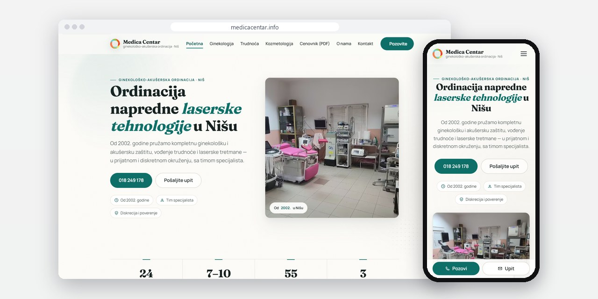
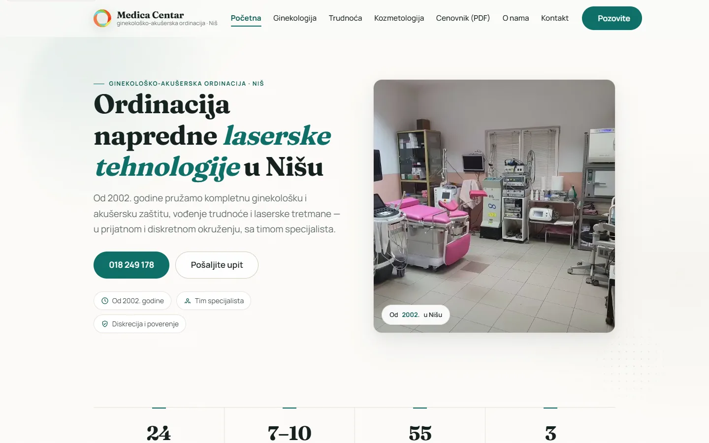
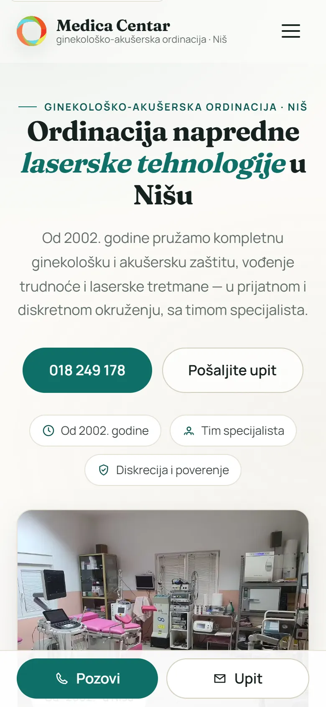
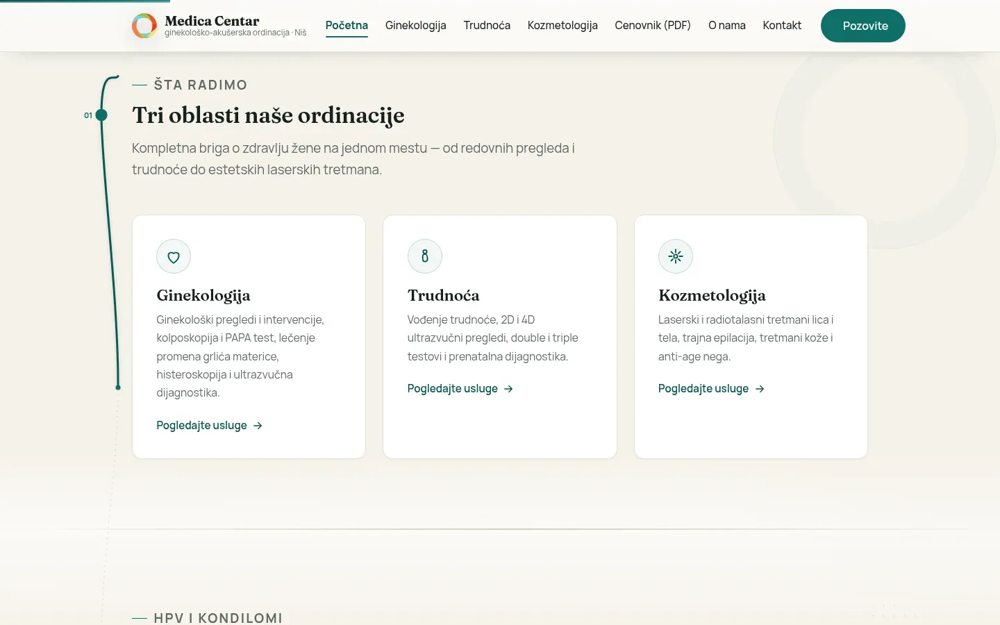
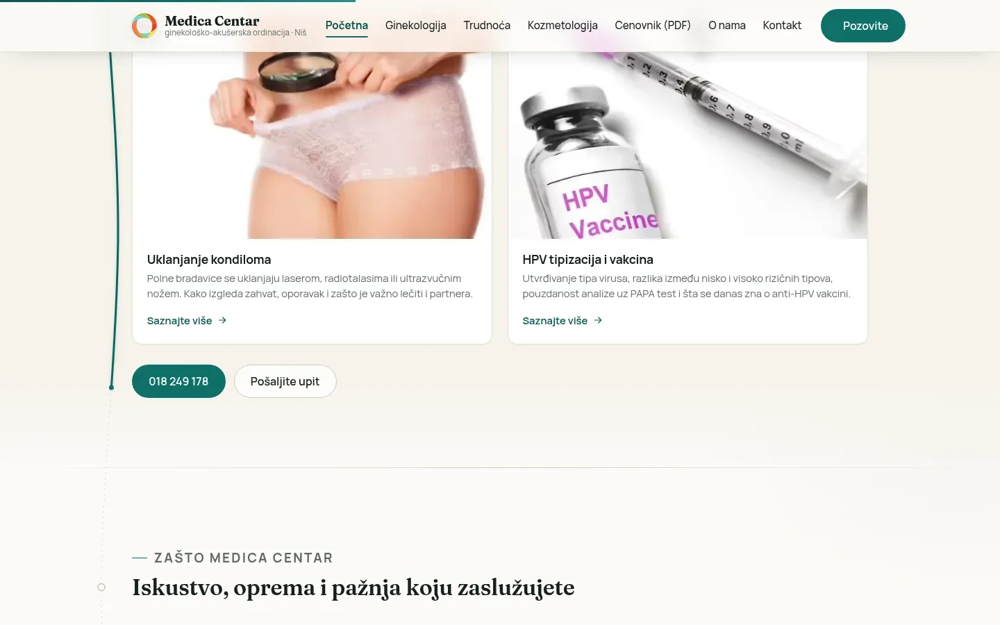

# Medica Centar

New site for a gynecology practice in Niš: 55 service pages built from JSON files, 69 redirects from the old site and a panel the practice edits itself.

**[medicacentar.info](https://medicacentar.info/)** · [Case study (in Serbian)](https://svilenkovic.com/radovi/medica-centar) · [Srpski](README.sr.md)

> [!NOTE]
> Client project. The source code belongs to the client and stays in a private repository. This page describes what I built and how.

<table>
  <tr><td><b>Client</b></td><td>Medica Centar</td></tr>
  <tr><td><b>Industry</b></td><td>Gynecology, obstetrics and laser cosmetology</td></tr>
  <tr><td><b>Location</b></td><td>Niš, Serbia</td></tr>
  <tr><td><b>Type</b></td><td>Multi-page website with an admin panel</td></tr>
  <tr><td><b>My role</b></td><td>Redesign, development, migration, SEO and maintenance</td></tr>
  <tr><td><b>Stack</b></td><td>PHP 8.3, JSON content, AVIF, SVG, Schema.org</td></tr>
</table>

## About the project

Medica Centar is a private gynecology and obstetrics practice in Niš, open since 2002, working in gynecology, pregnancy care and laser cosmetology. Its old site was a set of static HTML pages that didn't work on phones. It did hold long articles by the practice's doctor, 94 papers in PDF and 11 videos, so the move could not lose a single address.

The new site has 55 service pages (25 in gynecology, 10 in pregnancy, 20 in cosmetology) and no database. Content lives in JSON files, one per service and one per area, rendered by a few shared templates. The admin panel I added later writes to the same files and keeps the last 25 copies of each. A script checked all 69 redirects from the old URLs for status and target, and the archive went back to the exact addresses it had before.

## What I built

- A panel with CSRF protection, a lockout after five failed logins in 15 minutes, atomic writes and a change log
- A panel check that submits every section unchanged and compares the page HTML before and after; all ten sections came back identical, byte for byte
- A calm design with one muted accent, and a word-by-word heading reveal rebuilt without the overflow mask that was clipping the marks on š, ć and đ
- The logo redrawn as SVG from a 300 by 80 px PNG, and every photo in AVIF, the largest at 52 KB
- MedicalClinic data, BreadcrumbList on 68 pages and FAQPage on 53, taken from 178 questions already written on the service pages
- A contact form moved to the client's hosting with a local copy of the protection module it relied on, tested with a temporary recipient so the practice got no test messages

## Screenshots

<table>
  <tr>
    <td width="68%" valign="top"></td>
    <td width="32%" valign="top"></td>
  </tr>
</table>

Three areas under one roof: gynecology, pregnancy and cosmetology

A highlighted block on HPV and genital warts, then reasons to choose Medica Centar

---

Built by [D. Svilenković](https://svilenkovic.com).
